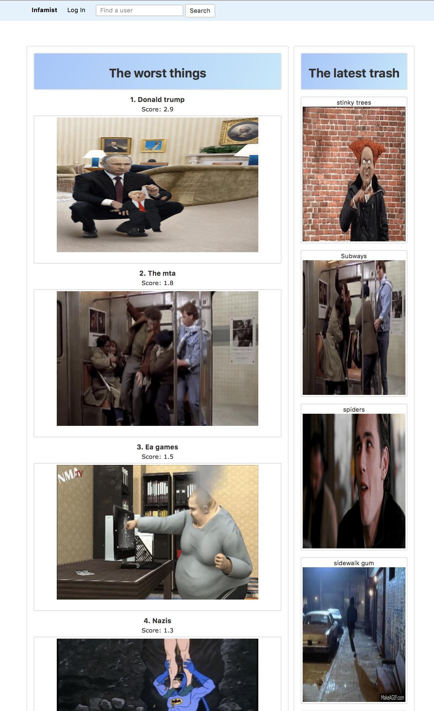

## Infamist
Infamist is a Rails site that allows users to create an authenticated account, build a list of 10 disfavored things or events and have a relevant gif from Giphy automatically associated with each item. User profiles show each users list and the homepage shows an aggregated list displaying the most commonly unliked items as well as a list of the newest items. The goal is a healthy and numerical airing of grievances against entities, places, and situations people find frustrating. This is not intended to harass or embarrass private individuals.

## Build status
Master is working with some UI bugs. This site might be forked and converted to a backend with a javascript based front end.

See Gemfile for dependencies
## Screenshots

## Installation
<code>git clone https://github.com/SuperJesseH/infamist</code>
<code>bundle install</code>
<code>rails s</code>

## Credits
Built by
[Shawn Tannor](https://github.com/ShawnCodes), [Ryan Hu](https://github.com/Ryhu), and [Jesse Horwitz](https://github.com/SuperJesseH)

## License
MIT ©
